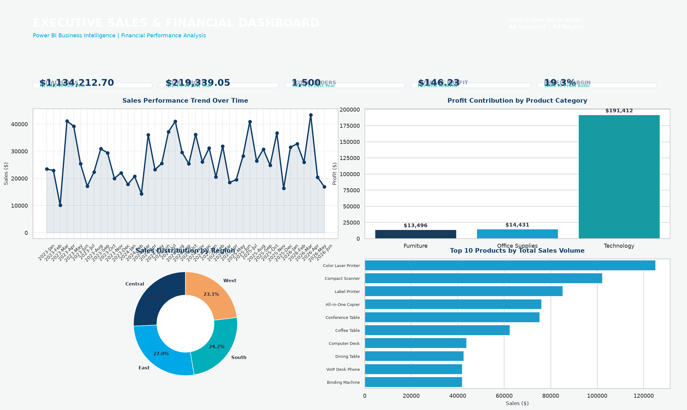
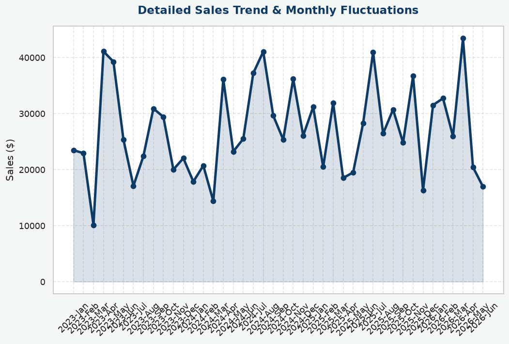
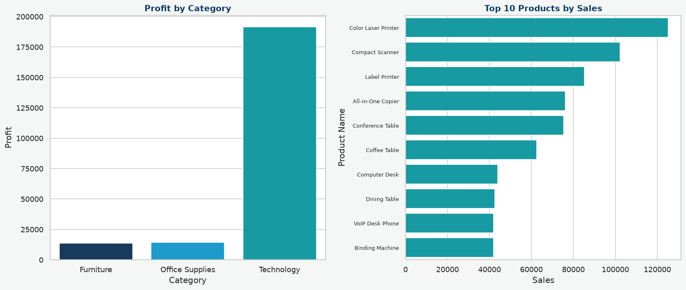
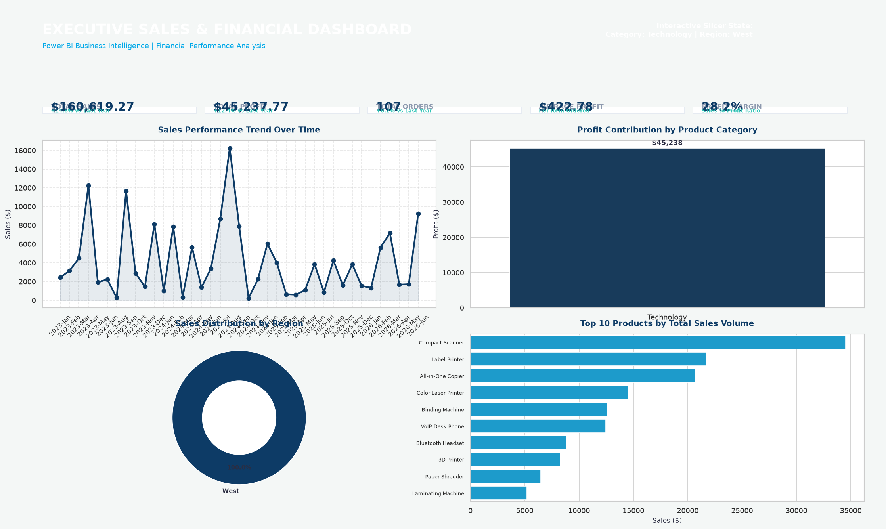

# 📊 Interactive Sales & Financial Power BI Dashboard

A professional and interactive **Business Intelligence Dashboard** built using **Power BI** to analyze sales and financial performance. This dashboard enables business stakeholders to monitor key metrics, identify trends, and make informed decisions through dynamic visualizations and interactive filters.

---

# 🎯 Objective

The objective of this project is to design an interactive dashboard that helps business stakeholders:

- Monitor Sales Performance
- Analyze Profitability
- Track Business Growth
- Compare Regional Performance
- Identify Top Performing Products
- Make Data-Driven Business Decisions

---

# 🛠️ Tools Used

- Microsoft Power BI Desktop
- Microsoft PowerPoint
- GitHub
- Kaggle Sales Financial Dataset

---

# 📂 Project Structure

```
Task-3-Dashboard-Design/
│
├── Dashboard/
│   ├── Sales_Dashboard.pbix
│   └── Dashboard.pdf
│
├── Dataset/
│   └── Sales_Financial.csv
│
├── PPT/
│   └── Dashboard_Summary.pptx
│
├── Screenshots/
│   ├── Dashboard_Home.png
│   ├── Sales_Trend.png
│   ├── Profit_Analysis.png
│   └── Filters.png
│
└── README.md
```

---

# 📊 Dataset Information

The dashboard is developed using a **Sales Financial Dataset** downloaded from **Kaggle**.

The dataset contains business transaction details such as:

- Order ID
- Order Date
- Customer Information
- Product Category
- Product Name
- Region
- Sales
- Profit
- Quantity
- Discount
- Year
- Month

---

# 📈 Dashboard KPIs

The dashboard provides the following Key Performance Indicators (KPIs):

- 💰 Total Sales
- 💵 Total Profit
- 📦 Total Orders
- 📈 Profit Margin
- 📊 Average Profit

---

# 📉 Dashboard Visualizations

### 📈 Sales Trend

- Line Chart
- Monthly Sales Analysis
- Time-Series Analysis

### 💰 Profit by Category

- Clustered Bar Chart
- Category-wise Profit Comparison

### 🌍 Sales by Region

- Donut Chart
- Regional Sales Distribution

### 🏆 Top Products

- Horizontal Bar Chart
- Top 10 Products by Sales

### 📅 Monthly Performance

- Monthly Sales Trend
- Business Growth Analysis

---

# 🎛️ Interactive Features

The dashboard includes interactive slicers for:

- Year
- Region
- Category
- Segment

Users can dynamically filter the dashboard to analyze different business scenarios.

---

# 📌 DAX Measures Used

```DAX
Total Sales =
SUM(Sales_Financial[Sales])

Total Profit =
SUM(Sales_Financial[Profit])

Total Orders =
DISTINCTCOUNT(Sales_Financial[Order ID])

Average Profit =
AVERAGE(Sales_Financial[Profit])

Profit Margin =
DIVIDE([Total Profit],[Total Sales],0)
```

---

# 🎨 Dashboard Features

- Professional Dashboard Design
- KPI Cards
- Interactive Slicers
- Time-Series Analysis
- Business Insights
- Regional Analysis
- Product Performance Analysis
- Consistent Blue & White Theme
- Clean Dashboard Layout

---

# 📊 Power BI Dashboard

📂 **Power BI File**

[Sales_Dashboard.pbix](Dashboard/Sales_Dashboard.pbix)

---

# 📄 Dashboard Report

📄 **Dashboard PDF**

[Dashboard.pdf](Dashboard/Dashboard.pdf)

---

# 📑 PowerPoint Presentation

📄 **Project PPT**

[Dashboard_Summary.pptx](PPT/Dashboard_Summary.pptx)

---

# 📁 Dataset

📊 **Sales Financial Dataset**

[Sales_Financial.csv](Dataset/Sales_Financial.csv)

---

# 📷 Dashboard Screenshots

## 🏠 Dashboard Home



---

## 📈 Sales Trend



---

## 💰 Profit Analysis



---

## 🎛️ Interactive Filters



---

# 💡 Business Insights

The dashboard helps stakeholders to:

- Monitor overall business performance
- Track revenue and profit trends
- Compare regional performance
- Analyze category-wise profitability
- Identify top-selling products
- Make informed business decisions using interactive reports

---

# 🚀 How to Use

1. Clone this repository.

```bash
git clone https://github.com/your-github-username/Task-3-Dashboard-Design.git
```

2. Open **Sales_Dashboard.pbix** using **Microsoft Power BI Desktop**.

3. Explore the dashboard using the available slicers and filters.

4. Review the PDF report and PowerPoint presentation for project documentation.

---

# 🎯 Learning Outcomes

Through this project, I learned to:

- Design professional dashboards in Power BI
- Create interactive reports
- Build KPI cards
- Use DAX measures
- Perform time-series analysis
- Create business-oriented visualizations
- Apply filters and slicers
- Present insights effectively for stakeholders

---

# 👩‍💻 Author

**Kesani Navya Sri**

**B.Tech – Computer Science and Engineering (Artificial Intelligence & Machine Learning)**

---

# 📜 License

This project is created for **educational and internship evaluation purposes**.
